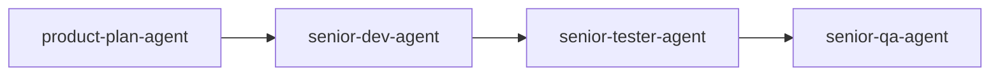

# Feature Workflow

Standard sequence for portfolio monorepo feature work:

## Rules

- The product handoff is the contract; do not expand scope in dev without replanning.
- Update `specifications/<branch>/SPEC.md` when requirements change mid-branch.
- Auth, routing, or deployment changes must reference `REPO_SPEC.md` constraints.
- Subproject-only fixes may skip full QA if verification is documented in the dev handoff.

## SDD Integration

1. Read `specifications/REPO_SPEC.md`
2. Create or update `specifications/<branch-name>/SPEC.md` for the branch
3. Implement the branch delta only
4. On iteration branches, promote durable guidance back to `REPO_SPEC.md` (see `sdd.md`)
