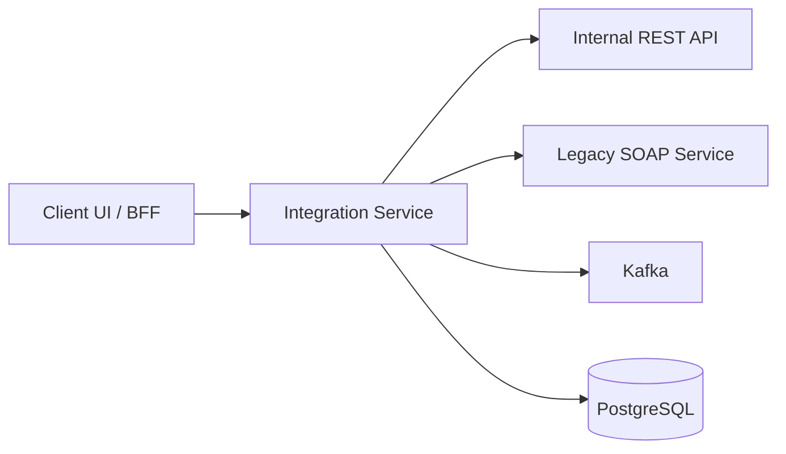

# AI-Assisted Repository Specification Workflow

## Purpose

This instruction set defines a repository-local documentation pattern for AI-assisted software development in multi-branch Git workflows.

The goals are to:

- keep durable project guidance inside the repository
- support concurrent development branches without turning one shared spec into a merge-conflict hotspot
- give coding agents a stable baseline plus a branch-scoped implementation contract
- promote new durable knowledge from branch work back into the repository baseline in a controlled way

## Directory Structure

Use the following structure:

```text
specifications/
  REPO_SPEC.md
  <branch-name>/
    SPEC.md
```

Examples:

```text
specifications/
  REPO_SPEC.md
  feature-email-simulator/
    SPEC.md
  story-user-transfer-fix/
    SPEC.md
  refactor-soap-adapter/
    SPEC.md
```

The `<branch-name>` directory should match the actual Git branch name whenever practical. If branch names contain characters that are awkward for filesystem use, use a sanitized but recognizable equivalent and record the exact Git branch name inside the file.

## REPO_SPEC.md

`specifications/REPO_SPEC.md` is the durable repository-level baseline.

It defines the long-lived engineering contract for the repository and should change relatively slowly.

### REPO_SPEC.md should capture

#### 1. Overall application name and purpose

This section should clearly identify:

- the application or service name
- the business purpose of the repository
- the role the repository plays in the larger system

Examples:

- Integration Service for a BFF + Integration pattern
- Customer Case Management UI
- Notification Orchestration Service
- Shared Java client library for internal platform APIs

#### 2. Architectural role

This section should describe what the repository is responsible for and what it is not responsible for.

Examples:

- system boundary
- upstream and downstream dependencies
- whether the repo is a BFF, integration service, UI, library, batch service, event consumer, or orchestrator
- whether it owns domain logic, protocol translation, persistence, or presentation

#### 3. Technology baseline

This section should describe the durable technical choices in the repo, such as:

- language and framework
- build tool
- protocols used
- persistence technology
- messaging/event technologies
- runtime/deployment assumptions

Examples:

- Java 21 + Spring Boot
- Maven rather than Gradle
- REST and SOAP integration patterns
- Kafka for event transport
- PostgreSQL for persistence

#### 4. Implementation guidelines

This section should define engineering conventions such as:

- logging standards
- naming standards
- error handling patterns
- package and module organization
- controller/service/client separation
- DTO and domain-object conventions
- configuration conventions
- observability expectations
- security constraints
- testing conventions

#### 5. Preferred project structure

If there is a desired Spring Boot or other project structure, capture it here.

Examples:

- `controller`
- `service`
- `client`
- `config`
- `model`
- `entity`
- `repository`
- `mapper`
- `exception`
- `util`

This section should distinguish between:

- **current structure in the repo today**
- **preferred structure moving forward**

if those are not yet the same.

#### 6. Constraints and do-not-break rules

This section should define durable constraints such as:

- compatibility expectations
- security boundaries
- performance constraints
- required protocols
- stable APIs and schemas
- prohibited patterns

Examples:

- internal HTTP self-calls are prohibited inside the same service
- controller classes must not contain integration logic
- external SOAP calls must be isolated in adapter/client packages
- public contract changes must be backward compatible unless explicitly approved

## Architecture Diagram Recommendation

`REPO_SPEC.md` should include or reference an architecture diagram in a format that an AI agent can easily digest.

Preferred formats:

1. **Mermaid**
2. **PlantUML**
3. **simple structured ASCII diagram**

Mermaid is recommended as the default because it is readable as text, easy to diff in Git, and usually understandable by coding agents without extra tooling.

### Recommended diagram content

The diagram should show:

- repository under discussion
- upstream callers
- downstream integrations
- storage dependencies
- messaging/event dependencies
- key protocol boundaries
- major internal layers if useful

### Example Mermaid diagram



If the architecture is complex, a repo-level diagram plus one or more focused subsystem diagrams is preferable to one large unreadable diagram.

## Branch-Level SPEC.md

Each active development branch should have its own branch-scoped spec:

```text
specifications/<branch-name>/SPEC.md
```

This file is the implementation contract for the work on that branch.

### Branch-level SPEC.md should capture

- exact branch name
- story or task name
- purpose of the branch
- scope of changes
- files or modules expected to change
- explicit requirements for the branch
- acceptance criteria
- out-of-scope items
- temporary branch-local design decisions
- dependencies on other branches or pending work
- relationship to `specifications/REPO_SPEC.md`

### Branch SPEC.md maintenance rule

The branch `SPEC.md` should be treated as a living implementation contract for the active branch.

When the developer provides new prompts that add requirements, clarify behavior, tighten constraints, adjust scope, or otherwise change the expected implementation, the model should update `specifications/<branch-name>/SPEC.md` as part of the working process.

The goal is to keep the branch spec current without requiring the developer to repeatedly issue a separate instruction to update the spec.

This update behavior should follow these guardrails:

- update the branch `SPEC.md` when a new prompt changes implementation intent, requirements, acceptance criteria, scope, or constraints
- do not rewrite the branch `SPEC.md` for conversational chatter that does not affect implementation
- preserve prior requirements unless they are explicitly replaced or contradicted by newer direction
- prefer incremental edits that keep the file aligned with the latest branch intent
- keep the branch `SPEC.md` synchronized closely enough that another developer or agent could resume the branch using the file as the current contract

### Precedence rule

Branch `SPEC.md` should inherit the baseline from `REPO_SPEC.md`.

A branch-level spec should override repository-level guidance only where the branch explicitly requires it, and only for the work in scope for that branch.

### Recommended opening note for branch specs

```md
# SPEC

Branch: <branch-name>

Read first:
- specifications/REPO_SPEC.md

This file defines the implementation delta for this branch.
Repository-level standards remain in effect unless this branch spec explicitly states otherwise for in-scope work.
```

## Starting This on a Pre-Existing Repository

Do not begin by trying to write the ideal target-state spec from memory.

Start by describing the repository as it actually exists today.

### Recommended rollout

#### Phase 1: Derive the current baseline

Create `specifications/REPO_SPEC.md` from the existing codebase.

Capture:

- actual purpose of the repository
- actual application/service name
- current architecture role
- language/framework/build tool in use
- current package/module structure
- current logging approach
- current naming conventions
- current protocols and integrations
- current test structure
- current deployment assumptions

This first version should be descriptive before it becomes strongly prescriptive.

#### Phase 2: Identify inconsistencies

Add a section such as `Current State Notes` or `Known Inconsistencies` to record mixed patterns without pretending they are standards.

Examples:

- both constructor injection and field injection exist
- both Gradle wrapper artifacts and Maven artifacts are present
- SOAP and REST adapters are intermixed in the same package
- logging format is inconsistent across modules

#### Phase 3: Gradually tighten standards

As the repository evolves, update `REPO_SPEC.md` to clarify which patterns are preferred moving forward.

This allows the baseline to become more prescriptive over time without misrepresenting the current codebase.

## Suggested Prompt to Derive REPO_SPEC.md from an Existing Repository

Use a prompt like the following with an AI coding agent:

```text
Examine this repository and derive a baseline repository specification.

Create specifications/REPO_SPEC.md based on the repository as it exists today.

Goals:
1. Identify the overall application or service name if it can be inferred.
2. Identify the purpose of this repository within the larger system.
3. Infer the architectural role of the repository, such as BFF, integration service, UI, library, batch processor, or event consumer.
4. Identify the language, framework, build tool, protocols, logging approach, test framework, and project structure currently in use.
5. Summarize implementation conventions that appear consistently in the codebase.
6. Separate inconsistencies or mixed patterns into a section called Current State Notes rather than presenting them as standards.
7. Recommend a preferred project structure only where it can be reasonably inferred from the codebase.
8. Include an architecture diagram in Mermaid if enough information exists to create one responsibly.
9. Do not invent requirements that are not supported by the repository contents.
10. Prefer describing the current truth of the repo first, then propose standards where appropriate.

Output sections:
- Application Name and Purpose
- Architectural Role
- Architecture Diagram
- Technology Stack
- Build and Run
- Project Structure
- Implementation Guidelines
- Logging and Observability
- Naming Standards
- Protocols and Integration Patterns
- Testing Approach
- Current State Notes
- Constraints and Do-Not-Break Rules
```

## Iteration Promotion Workflow

At the end of each iteration, create a dedicated branch named after the iteration.

Example:

```text
iteration-2026-05-1
iteration-q2-hardening
iteration-release-prep-01
```

This special branch exists to review branch-level specs and promote durable new knowledge into `REPO_SPEC.md`.

### Iteration branch structure

```text
specifications/
  REPO_SPEC.md
  iteration-2026-05-1/
    SPEC.md
```

### Purpose of the iteration branch SPEC.md

The iteration branch `SPEC.md` should instruct the agent to:

1. examine completed or in-progress `specifications/<branch-name>/SPEC.md` files
2. identify new durable standards, constraints, structures, or conventions that should become repository-level guidance
3. update `specifications/REPO_SPEC.md` with anything appropriate and genuinely reusable
4. avoid promoting temporary branch-local decisions into the repo baseline
5. keep `REPO_SPEC.md` concise, durable, and repository-wide
6. prepare the changes for merge so the updated baseline becomes available to future branches

### Recommended purpose statement for the iteration branch SPEC.md

```md
# SPEC

Branch: iteration-2026-05-1

Purpose:
Review branch-level specifications under specifications/<branch-name>/SPEC.md and incorporate any durable, repository-wide guidance into specifications/REPO_SPEC.md.

Include only guidance that is appropriate for future work across the repository.
Do not promote temporary branch-specific decisions, experimental approaches, or incomplete work into the repository baseline.
```

## Merge Model

### Normal feature or story branches

For a normal working branch:

1. read `specifications/REPO_SPEC.md`
2. create `specifications/<branch-name>/SPEC.md`
3. implement only the branch-level delta
4. avoid changing `REPO_SPEC.md` unless the branch clearly introduces durable repository-wide truth

### Iteration branches

For the iteration branch:

1. read `specifications/REPO_SPEC.md`
2. examine relevant completed branch-level specs
3. promote appropriate durable guidance into `REPO_SPEC.md`
4. merge the iteration branch so the baseline is refreshed for the next cycle

## Recommended Guardrails

### 1. Keep REPO_SPEC.md durable

`REPO_SPEC.md` should not become a running journal of temporary branch work.

### 2. Keep branch SPEC.md narrow

Each branch `SPEC.md` should be tightly scoped to the work that is actually being merged.

### 3. Promote only stable truths

Only changes that are broadly reusable, durable, and repository-level should be moved into `REPO_SPEC.md`.

### 4. Prefer diagrams that stay text-based

Use Mermaid, PlantUML, or structured ASCII diagrams so diagrams remain versionable and easy for agents to parse.

### 5. Make branch identity explicit

Each branch `SPEC.md` should record the branch name clearly to avoid ambiguity when files are reviewed later.

## Summary

Use this model:

- `specifications/REPO_SPEC.md` for durable repository-level purpose, architecture, standards, constraints, and diagram(s)
- `specifications/<branch-name>/SPEC.md` for branch-level implementation instructions
- `specifications/<iteration-name>/SPEC.md` on a special iteration branch to promote durable knowledge from branch specs into `REPO_SPEC.md`

This pattern keeps the specification structure inside the repository while supporting concurrent branches, controlled evolution of standards, and effective AI-assisted development.
