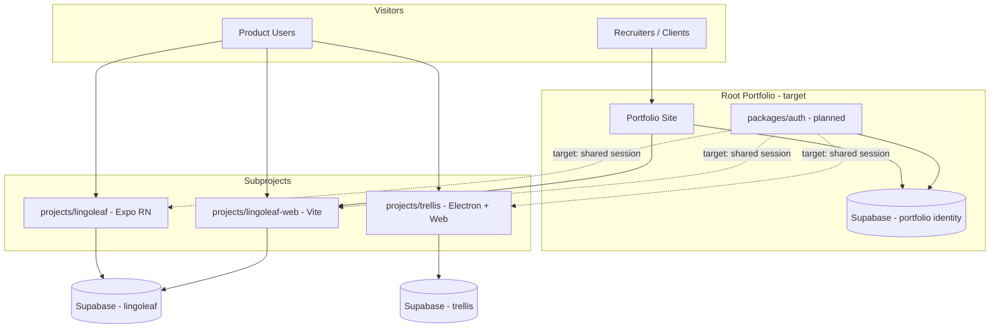

# REPO_SPEC — Portfolio Monorepo

> Descriptive baseline derived from the repository as it exists today. Standards tighten as the portfolio app is built.

## Application Name and Purpose

**Portfolio** — A monorepo housing Connor Pepin's personal portfolio application and independent product subprojects (LingoLeaf, Trellis, LingoLeaf Web).

**Purpose:** Showcase full-stack engineering skills to potential clients and employers through a distinctive, high-performance site that embeds or links to real shipped work.

**Domain:** [connorjpepin.com](https://connorjpepin.com) (existing; root app not yet implemented in this repo)

## Architectural Role



**Root owns:** Portfolio presentation, routing to subproject demos, centralized auth contract (planned), deployment orchestration.

**Root does not own:** LingoLeaf EPUB/translation logic, Trellis vault/AI extraction, or subproject-specific database schemas.

## Technology Stack

| Layer | Current state | Target (decided) |
|-------|---------------|------------------|
| Root portfolio app | **Scaffolded** at `apps/portfolio` | Astro + React islands, Tailwind, Cloudflare Pages |
| Hosting | lingoleaf-web on Cloudflare Pages | **Cloudflare Pages** for connorjpepin.com root |
| Sub: lingoleaf | Expo 52, React Native, Supabase | Unchanged in pass 1; auth migrates later |
| Sub: lingoleaf-web | Vite, React 18, Tailwind, shadcn | Served under `/lingoleaf`; proxy or path routing from root |
| Sub: trellis | Electron, pnpm monorepo, Vite web, Supabase Edge Functions | Showcase only in pass 1; auth migrates later |
| Identity | Separate Supabase projects per product | **One Supabase project** — portfolio auth + per-product schemas (`lingoleaf`, `trellis`, `portfolio`) |
| Spec workflow | `sdd.md` + `specifications/` | Active |
| Visual design | — | **Swagger UI** — dark, interactive docs styling |
| Contact UX | — | **POST /contact** — form as API endpoint (not terminal) |

## Build and Run

```bash
# Subprojects (each independent today)
cd projects/lingoleaf && npm install && npm start
cd projects/lingoleaf-web && npm install && npm run dev
cd projects/trellis && pnpm install && pnpm run dev:web

# Root portfolio app
cd apps/portfolio && npm install && npm run dev
```

## Project Structure

```text
portfolio/
  AGENTS.md                 # Monorepo agent contract
  sdd.md                    # SDD workflow definition
  specifications/
    REPO_SPEC.md            # This file
    <branch-name>/SPEC.md   # Branch implementation deltas
  docs/agents/              # Multi-agent handoffs
  .cursor/skills/           # Cursor agent skills
  .codex/skills/            # Codex agent skills
  projects/
    lingoleaf/              # Expo mobile app
    lingoleaf-web/          # Marketing + forum site
    trellis/                # Desktop + web knowledge app
  apps/                     # (planned) root portfolio application
  packages/                 # (planned) shared auth, UI tokens, content
```

## Implementation Guidelines

- **SDD:** Read this file first; branch work lives in `specifications/<branch>/SPEC.md`
- **Content as data:** Resume/experience content should be structured (JSON/YAML/MDX) so the "API docs" UI renders from a single source of truth
- **Performance:** Static generation or edge-first; lazy-load heavy demos (LingoLeaf web embed, Trellis screenshots/video)
- **Accessibility:** Documentation-style UI must remain keyboard-navigable and screen-reader friendly
- **Subproject isolation:** Do not import subproject internals into root; embed via iframe, static export, or documented API boundaries

## Profile Content (from resume)

**Experience:** Mastercard (Spring Boot, CD platform), Caralyst Health (full-stack lead), Crosswalk Legal (real-time sync MVP)

**Projects:** Repo Magik (internal analytics), LingoLeaf (RN + Supabase), Trellis (Electron + local-first AI)

**Skills:** TypeScript/JavaScript, Java/Spring Boot, React, Angular, Node, PostgreSQL, AWS, CI/CD, AI-assisted development

## Current State Notes

- Root `AGENTS.md` and `REPO_SPEC.md` were empty until initial setup
- Root portfolio app scaffolded at `apps/portfolio` (Astro + React islands)
- LingoLeaf mobile and lingoleaf-web share a Supabase project (`lingoleaf` schema)
- Trellis uses a separate Supabase project with Edge Functions for AI/chat
- Trellis has mature `.codex/skills/` workflow; root now mirrors that pattern
- `lingoleaf-web` README references standalone GitHub repo; copy lives under `projects/` in this monorepo
- Auth centralization is **planned**, not implemented

## Constraints and Do-Not-Break Rules

- Do not break subproject production deployments while migrating auth
- Do not commit secrets or read `.env` files in agent workflows (LingoLeaf AGENTS.md rule applies)
- Subproject RLS schemas remain owned by each product; portfolio auth must not weaken isolation
- Keep portfolio first-load fast (< 100KB critical JS target for landing — adjust per stack choice)
- Preserve `/lingoleaf/*` URL compatibility for existing LingoLeaf Web routes
